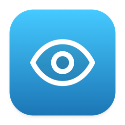
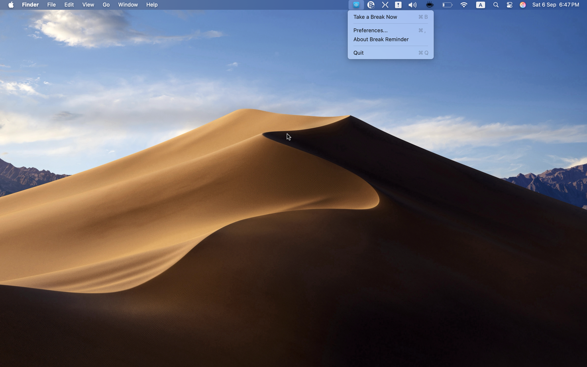
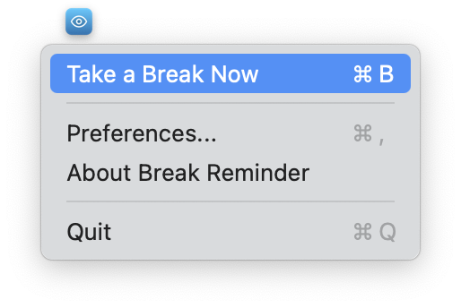
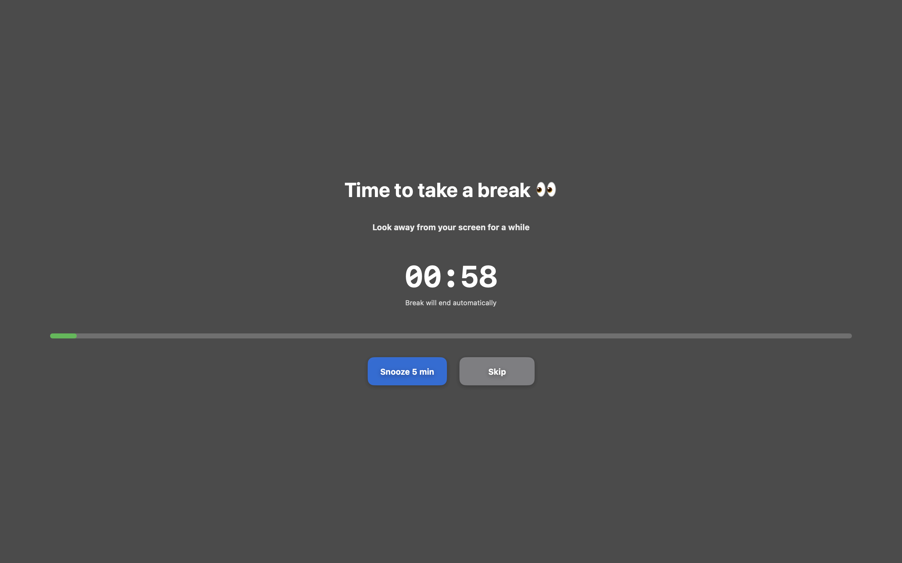
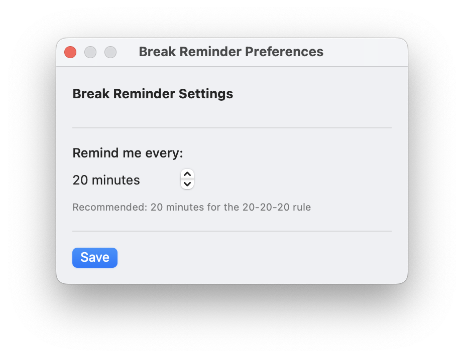

<p align="center">
  
</p>

<h1 align="center">Break Reminder</h1>

<p align="center">
  A quiet macOS menu bar app that nudges you to rest your eyes.<br>
  Built around the <strong>20-20-20 rule</strong>: every 20 minutes, look 20 feet away for 20 seconds.
</p>

<p align="center">
  <a href="https://github.com/iam-mhaseeb/Break-Reminder/releases/latest/download/BreakReminder.zip">
    
  </a>
  &nbsp;
  <a href="https://github.com/iam-mhaseeb/Break-Reminder/releases/latest">
    
  </a>
</p>

<p align="center">
  <a href="https://github.com/iam-mhaseeb/Break-Reminder/releases/latest/download/BreakReminder.zip"><strong>Download for macOS</strong></a>
  ·
  <a href="https://github.com/iam-mhaseeb/Break-Reminder/releases/latest">All releases</a>
  ·
  <a href="#installation">Install</a>
  ·
  <a href="#usage">Usage</a>
</p>

---

## Why it exists

Staring at a screen for hours strains your eyes, dries them out, and makes it harder to stay focused. Break Reminder sits in the menu bar and, on a schedule you choose, covers the screen with a calm overlay so you actually look away.

The default interval is **20 minutes**. Each break lasts **60 seconds**, then the overlay closes on its own.

## Features

| | |
| --- | --- |
| **Your schedule** | Reminders every 5–60 minutes, in 5-minute steps. Default is 20. |
| **Full-screen overlay** | A dim screen, a countdown, and a progress bar. The menu bar and Dock stay out of the way. |
| **Snooze or skip** | Postpone for 5 minutes, or dismiss the break if you are in the middle of something. |
| **Take a break now** | Trigger an overlay immediately with **⌘B**. |
| **Menu bar only** | No Dock icon. The app stays out of the way until it is time to rest. |
| **Preferences** | Change the interval from the menu (**⌘,**) and the timer restarts with the new setting. |

## Screenshots

<table>
  <tr>
    <td width="50%" align="center" valign="top">
      <strong>Menu bar</strong><br><br>
      
    </td>
    <td width="50%" align="center" valign="top">
      <strong>Preferences</strong><br><br>
      
    </td>
  </tr>
  <tr>
    <td align="center" valign="top">
      <strong>Break overlay</strong><br><br>
      
    </td>
    <td align="center" valign="top">
      <strong>About</strong><br><br>
      
    </td>
  </tr>
</table>

## Installation

**Requires macOS 15.3 or later.**

1. [Download BreakReminder.zip](https://github.com/iam-mhaseeb/Break-Reminder/releases/latest/download/BreakReminder.zip) from the [latest release](https://github.com/iam-mhaseeb/Break-Reminder/releases/latest).
2. Unzip it and move **Break Reminder** into your Applications folder.
3. Open it from Applications or Spotlight. It appears in the menu bar and starts the 20-minute timer.

If macOS says the app cannot be opened because it is from an unidentified developer, right-click the app, choose **Open**, then confirm.

### Build from source

You need Xcode 16 or newer.

```bash
git clone https://github.com/iam-mhaseeb/Break-Reminder.git
cd Break-Reminder
open BreakReminder.xcodeproj
```

Build and run with **⌘R**.

## Usage

Launch the app. An eye icon stays in the menu bar. Breaks start on their own.

| Menu item | Shortcut | What it does |
| --- | --- | --- |
| Take a Break Now | ⌘B | Shows the overlay immediately |
| Preferences… | ⌘, | Sets how often reminders appear |
| About Break Reminder | | Version and credits |
| Quit | ⌘Q | Stops the timer and exits |

During a break you can:

- **Snooze 5 min** — close the overlay and ask again in five minutes
- **Skip** — end this break and keep the normal schedule
- Wait — the overlay closes itself after 60 seconds

To change the interval, open Preferences, pick a value from 5 to 60 minutes, and click **Save**. The timer restarts with the new interval.

## The 20-20-20 rule

- Every **20 minutes**, look away from the screen.
- Look at something about **20 feet** away.
- Keep looking for at least **20 seconds**.

Break Reminder uses a 60-second overlay so the pause is long enough to be useful, with 20 minutes as the recommended interval.

## How it is built

SwiftUI for the overlay, preferences, and about window. AppKit for the status item, the full-screen window, and hiding the Dock. Preferences are stored in `UserDefaults`.

| File | Role |
| --- | --- |
| `BreakReminderApp.swift` | App entry point |
| `AppDelegate.swift` | Menu bar, preferences, and about windows |
| `BreakReminder.swift` | Timer, snooze, and saved interval |
| `BreakOverlayView.swift` | Countdown and snooze / skip controls |
| `BreakOverlayWindow.swift` | Full-screen window above the menu bar |
| `PreferencesView.swift` | Interval stepper |

## Contributing

Issues and pull requests are welcome. For a larger change, open an issue first so the direction is clear.

1. Fork the repository and create a branch.
2. Make the change and commit it.
3. Open a pull request against `main`.

Questions and bug reports go in [Issues](https://github.com/iam-mhaseeb/Break-Reminder/issues). Include your macOS version and what you expected to happen.

---

<p align="center">
  <a href="https://github.com/iam-mhaseeb/Break-Reminder/releases/latest/download/BreakReminder.zip"><strong>Download Break Reminder</strong></a>
  <br>
  <sub>Look away once in a while. Your eyes will thank you.</sub>
</p>
